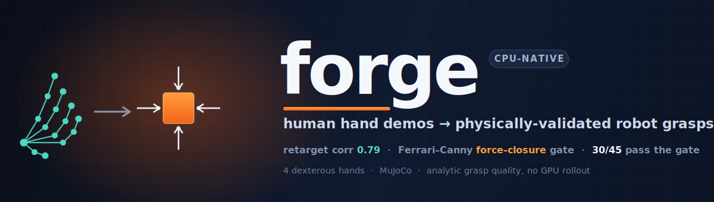

<div align="center">



<br/>


### One human hand demo in. Validated grasp trajectories for many robot hands out. On a laptop CPU.

</div>

---

## At a glance

forge is a four-stage pipeline that turns one human hand demonstration into many physically-screened robot grasp trajectories:

- **Relocate** the demo into new scenes with object-centric SE(3) replay.
- **Retarget** the human finger motion onto each robot hand by optimization-based IK.
- **Gate** every candidate with a closed-form Ferrari-Canny force-closure test, no simulation.
- **Yield** only the grasps that pass: 30 of 45 candidates validated, in ~9 s, on a CPU.

---

## Why this matters

Robot manipulation does not have an algorithm problem so much as a **data-economics** problem. Every dexterous hand (LEAP, Allegro, Shadow, the next one) is effectively its own language, and a grasp recorded on one does not run on another. Human hand demonstrations are the richest, cheapest source of manipulation behavior in existence, but they are recorded in yet another language: a five-fingered, high-DOF hand that no robot exactly matches.

So the demonstrations are abundant and the robots are starving, and the thing standing between them is *translation plus trust*: you have to convert a human demo onto each robot, and you have to know which converted grasps are actually any good. The conventional way to earn that trust is to roll every candidate grasp through physics simulation or a learned model, which is exactly the step that pushes these pipelines onto GPU clusters.

**forge's bet: you can earn that trust analytically.** Whether a grasp can hold is, at its core, a question about whether its contact forces span the space of disturbances, and that is a closed-form linear-algebra test, not a simulation. Replace the rollout with the test and the whole economics flips: cross-embodiment grasp data becomes something you manufacture on a laptop, in milliseconds, with no GPU in the loop.

## The approach

A single human trajectory is relocated into new scenes (SE(3) replay), retargeted onto each robot hand (optimization-based IK), and then screened by the **Ferrari-Canny Q1 force-closure metric**: a closed-form check on whether the squeezed grasp's contact wrenches span the origin, i.e. whether it can resist arbitrary external force.

The gate, which is the heart of forge, runs entirely on CPU:

- Linearize each contact's friction cone into a set of unit force rays.
- Lift each ray to a 6D wrench about the object's center of mass.
- Take the convex hull of those wrenches (the Grasp Wrench Space).
- The grasp holds **iff the origin sits inside the hull**; the margin ε is the distance to the nearest face.

Every stage is a small, independently testable module, and the diagnostics (`diagnose.py`, `audit_demo.py`, `tools/trace_match.py`) reproduce every number below from one command.

**Full write-up:** [The Problem](docs/PROBLEM.md) · [Method](docs/METHOD.md) · [Results & Evidence](docs/RESULTS.md)

## Results

Measured on a real DexCanvas pick demo (1,207 frames, object `cube1`), **CPU only**.

#### Retargeting fidelity
How tightly each robot's grip tracks the human's across the clip (correlation of the thumb-index gap; 1.0 is perfect):

| Robot hand | DOF | Grip-tracking corr | Speed |
|---|---|---|---|
| **LEAP** | 16 | **+0.79** | ~1.2 ms/frame |
| **Allegro** | 16 | **+0.77** | ~1.5 ms/frame |
| **Shadow** | 24 | **+0.69** | ~2.4 ms/frame |

#### Force-closure gate (Ferrari-Canny Q1, closed form, CPU)
Stability margin of the squeezed grasp, higher epsilon = more robust:

| Robot hand | Verdict | epsilon | Contacts |
|---|---|---|---|
| **LEAP** | ✅ force closure | **0.310** | 41 |
| **Allegro** | ✅ force closure | **0.078** | 5 |

#### Factory throughput

| Stage | Result | Time |
|---|---|---|
| Candidate generation | 45 / 45 | 6.3 s |
| **Force-closure validated** | **30 / 45** (LEAP 15, Allegro 15) | 8.9 s (**~197 ms/traj**) |

#### Correctness
- SE(3) relocation invariant: object-relative drift **4.4e-16** (machine precision).
- Test suite: **5 / 5 passing** (`python test_forge.py`).

## Cost & speed: why it runs on a laptop

This is the heart of forge. The grasp filter is the expensive step in any cross-embodiment data pipeline, and forge makes it cheap by construction:

| | Simulation-rollout / learned grasp pipelines | **forge** |
|---|---|---|
| Validation step | physics rollout or neural inference per candidate | **closed-form force-closure test** |
| Cost per candidate | O(sim steps) of contact dynamics | **O(contacts) linear algebra** |
| Hardware | GPU acceleration in the loop | **laptop CPU, no GPU** |
| Measured throughput | (cluster-dependent) | **~197 ms / validated trajectory** |
| Marginal cost of a new embodiment | re-run the rollouts | swap the hand model, re-run the gate |

The gate never simulates anything. It builds the grasp wrench matrix from the contact geometry and asks one convex question (does the wrench hull contain the origin), so screening a candidate is matrix algebra, not a rollout. That single design choice is what moves the whole factory off the cluster and onto a laptop, and it is why adding the next robot hand costs a model file and a few hundred milliseconds rather than a fresh batch of GPU time.

## Quickstart

```bash
# unpack (bundles real MuJoCo Menagerie hands; nothing to download)
tar -xzf forge.tar.gz && cd forge
python -m venv .venv && source .venv/bin/activate
pip install -r requirements.txt

# the test suite needs no data
python test_forge.py                                   # -> 5/5 PASS

# the pipeline and demo run on a DexCanvas mocap parquet
python diagnose.py    /path/to/mocap.parquet           # retargeting, force closure, factory yield
python render_demo.py /path/to/mocap.parquet trio      # cross-embodiment demo -> forge_demo.mp4

# camera controls
python render_demo.py /path/to/mocap.parquet trio az=-110 el=-16 zoom=1.1
python render_demo.py /path/to/mocap.parquet leap      # single hand, clean studio render
```

## What's in the box

| Module | Role |
|---|---|
| `forge/se3.py` | SE(3) pose math (compose, invert, convert) |
| `forge/multiply.py` | relocate a demo into new scenes while preserving object-relative geometry |
| `forge/datasets.py` | DexCanvas mocap loader (keypoints + object poses) |
| `forge/retarget.py` | optimization-based retargeter + a joint-space curl retargeter for faithful visualization |
| `forge/tune.py` | CEM **auto-discovery of pick-controller parameters** (no per-hand hand-tuning) |
| `forge/replay.py` | MuJoCo scene, the **Ferrari-Canny Q1 force-closure gate**, dynamic replay, and the force-capped **table-pick executor** |
| `forge/refine.py` | **force-closure grasp refinement** (CEM on the analytic margin, CPU) |
| `forge/hands.py` | loads the bundled robot hand models |
| `forge/factory.py` | end-to-end candidate generation + gating |
| `diagnose.py` | full instrumented pipeline report (the headline run) |
| `render_demo.py` | the demo renderer (single-hand + `trio`) |
| `audit_demo.py`, `run_factory.py` | grasp audit + factory entry point |
| `tools/` | secondary diagnostics (`trace_match`, `grasp_report`, `cube_dims`, `retarget_demo`) |

## Repository layout

```
forge/
├── README.md  ·  LICENSE  ·  requirements.txt  ·  .gitignore
├── forge/                  # the library
│   ├── se3.py  multiply.py  datasets.py  retarget.py
│   ├── replay.py           # force-closure gate + dynamic replay
│   ├── hands.py  factory.py  video.py
├── diagnose.py             # main pipeline report   (python diagnose.py data.parquet)
├── render_demo.py          # demo renderer          (python render_demo.py data.parquet trio)
├── audit_demo.py           # grasp audit
├── run_factory.py          # factory entry point + input loader
├── test_forge.py           # test suite             (python test_forge.py)
├── tools/                  # secondary diagnostics  (python tools/trace_match.py ...)
├── assets/menagerie/       # bundled LEAP / Allegro / Shadow hand models
└── docs/                   # PROBLEM · METHOD · RESULTS · banner.svg
```

## Documentation

The full write-up lives in [`docs/`](docs/):

| Doc | What's in it |
|---|---|
| [**The Problem**](docs/PROBLEM.md) | the data-economics framing and why it's the binding constraint |
| [**Method**](docs/METHOD.md) | the four stages in detail, including the force-closure math |
| [**Results & Evidence**](docs/RESULTS.md) | every measured number, interpreted, plus the cost argument |

## Roadmap

forge today is a **validated grasp-data factory**: it converts one human demo into many force-closure-validated robot grasp trajectories. The natural next milestone is **closed-loop dynamic execution**, turning each validated grasp into a controller that holds the object under full contact dynamics, so the factory's output drives policy learning end to end.

## AI usage disclosure

This project was built with heavy use of an AI assistant (Anthropic's Claude) as a pair-programming and debugging partner: drafting and refactoring code, diagnosing rendering and numerical issues, and iterating on the visualization. The research direction, system architecture, and engineering decisions were mine; I supplied the real DexCanvas data, ran every evaluation, and validated all numbers reported here against real runs. AI-suggested code that did not pass the tests or match the real-data diagnostics was rejected and reworked.

## Credits & licenses

The only third-party code copied verbatim into this repo is the robot hand models, each with its original license retained in-tree:

| Copied asset | Source | License |
|---|---|---|
| LEAP hand (`assets/menagerie/leap_hand/`) | [MuJoCo Menagerie](https://github.com/google-deepmind/mujoco_menagerie) | MIT, © 2023 Ananye Agarwal |
| Allegro hand (`assets/menagerie/wonik_allegro/`) | [MuJoCo Menagerie](https://github.com/google-deepmind/mujoco_menagerie) | BSD-3-Clause, © 2016 SimLab |
| Shadow hand (`assets/menagerie/shadow_hand/`) | [MuJoCo Menagerie](https://github.com/google-deepmind/mujoco_menagerie) | Apache-2.0 |

All Python under `forge/` is original to this project (the retargeter, SE(3)/relocation, force-closure solver, factory, diagnostics, and renderer were written from scratch).

## License

MIT (this project's own code). Bundled hand models retain the licenses above.
